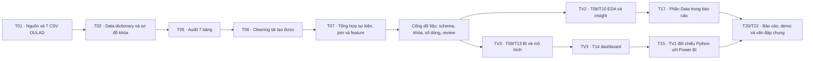

# Kế hoạch công việc TV1 — Data

**Task khởi tạo tài liệu:** T01. **Trạng thái kế hoạch:** bản nháp chờ TV2/TV3 review. Đây là kế hoạch thực hiện, không phải bằng chứng các bước dữ liệu đã hoàn thành. Nguồn yêu cầu là [DOCX gốc](../docs/source/TTDLTQ_script.docx); tiêu chí nghiệm thu và phụ thuộc nằm trong [backlog](../docs/06-tasks-and-dependencies.md), [rubric](../docs/02-rubric-traceability.md) và [hợp đồng dữ liệu](../docs/03-data-plan.md).

Hai phiếu giao việc hiện có: [Issue #1 — T01](https://github.com/vhoanglong54/TTDLTQ_FINAL/issues/1) và [Issue #2 — T02](https://github.com/vhoanglong54/TTDLTQ_FINAL/issues/2). **Owner:** `@Trung-Khang`; **reviewer TV2:** `@nadinedatalab`; TV3 (leader) duyệt lựa chọn dataset ở T01 và kiểm tra đầu ra dùng cho BI/model ở T02. Issue/PR là nơi ghi bằng chứng và nghiệm thu; bảng dưới đây là hướng dẫn thực hiện.

## Mục tiêu và quy tắc xuyên suốt

TV1 chịu trách nhiệm nguồn OULAD, data dictionary, audit, cleaning, join, feature engineering, đối chiếu số liệu Power BI và phần Data của báo cáo. TV1 hỗ trợ/review EDA, feature cho mô hình và demo; TV2 sở hữu insight/EDA, TV3 sở hữu Logistic Regression/Power BI. Mỗi task có Issue, nhánh chứa task ID, PR và ít nhất một người khác review trước khi đóng Issue. Ghi diễn biến thật vào [báo cáo TV1](report.md); chỉ đánh dấu rubric đạt khi có đường dẫn hiện vật và người review.

- Dữ liệu gốc gồm **7 CSV OULAD**. Hạt bảng phân tích chính là **một lượt học** theo `(code_module, code_presentation, id_student)`; không đồng nhất lượt học với số sinh viên duy nhất.
- `At_Risk = 1` cho `Fail/Withdrawn`, `0` cho `Pass/Distinction`. `final_result` và `At_Risk` chỉ là nhãn/kết quả; không đưa dữ liệu sau mốc dự báo vào feature.
- Không tạo cột sleep, stress, attendance, study hours hay previous grade khi OULAD không có. VLE clicks chỉ là proxy tương tác; `imd_band` mô tả khu vực, không phải thu nhập cá nhân. Ghi chênh lệch và quyết định tại [decision log](../docs/08-decisions-and-open-questions.md).
- CSV raw/interim/processed ở máy cục bộ và đã bị `.gitignore`; không commit dữ liệu lớn hoặc notebook có output nặng. Script trong `src/` là nguồn tái tạo; notebook dùng giải thích và kiểm tra.

## Workflow tổng quát



Phụ thuộc trong sơ đồ là điều kiện **nghiệm thu**; việc chuẩn bị có thể làm song song theo backlog. Sau mỗi mốc, lưu lệnh chạy, số liệu kiểm tra, hiện vật, PR và người review trong [report.md](report.md).

Riêng T02, có thể chuẩn bị khung `docs/09-data-dictionary.md` khi T01 còn mở; số dòng, kiểu thực, missing và kết luận khóa phải đợi 7 CSV được T01 xác nhận. Đây là quan hệ làm song song được mô tả trong [Issue #2](https://github.com/vhoanglong54/TTDLTQ_FINAL/issues/2).

## Bảng giai đoạn và bàn giao

Trạng thái dùng thống nhất: `Chưa bắt đầu` → `Đang làm` → `Chờ review` → `Đã nghiệm thu`; `Bị chặn` chỉ khi có nguyên nhân cụ thể. Bảng phản ánh thời điểm lập kế hoạch. Các giai đoạn hỗ trợ chỉ được ghi hoàn tất khi owner của task xác nhận.

| Giai đoạn / task | Nội dung và hướng dẫn thực hiện | Việc thủ công cần ghi rõ | Input | Output và điều kiện kiểm tra | Phụ thuộc; bàn giao cho | Trạng thái | Ghi chú |
|---|---|---|---|---|---|---|---|
| 1. Xác minh nguồn — **T01 / [#1](https://github.com/vhoanglong54/TTDLTQ_FINAL/issues/1)** | Đã kiểm kê 7 CSV tại `data/raw/` bằng `src/verify_oulad_source.py`: tên, số dòng, số cột, SHA-256, header khóa, `final_result` và `region` nằm trong [data/README.md](../data/README.md). Đối chiếu nguồn [UCI](https://archive.ics.uci.edu/dataset/349/open+university+learning+analytics+dataset)/Open University; cập nhật giới hạn nguồn tại decision log. | Đã extract/kiểm kê; không commit CSV gốc. Ngày tải archive chính xác chưa có bằng chứng cục bộ. | 7 CSV cục bộ, `OULAD.names`, trang UCI. | `data/README.md` có bảng kiểm kê và lệnh tái tạo; test 7/7 header đạt, 10.900.970 dòng tổng, ≥5.000 dòng, ≥3 bảng nối được, có `final_result` và `region`. | T01 đã đóng; bàn giao T02, T03, T04. | Đã nghiệm thu theo Issue #1 | `OULAD.names` và CSV có chênh lệch 32.953/32.593, theo dõi D11. |
| 2. Hợp đồng dữ liệu — **T02 / [#2](https://github.com/vhoanglong54/TTDLTQ_FINAL/issues/2)** | Lập từ điển từ 7 CSV thực: đủ 43 cột, dtype, nghĩa, giá trị/missing, vai trò, hạt/khóa, sơ đồ và biến bàn giao; tổng hợp hai bảng event trước join. | **Không có thao tác thủ công còn thiếu** ngoài review TV2/TV3; không commit raw. | T01 đã closed; 7 CSV `data/raw/`, [data plan](../docs/03-data-plan.md). | [docs/09-data-dictionary.md](../docs/09-data-dictionary.md), link từ `data/README.md`, script `src/profile_oulad_contract.py`; test schema/key/join. | Bàn giao TV2 review nghĩa biến, TV3 kiểm tra BI/model; đầu ra T05/T07. | Chờ review | `?` là mã missing cần T05; chưa cleaning/feature/BI. PR phải merge và ghi nghiệm thu Issue #2 trước khi đóng. |
| 3. Audit — **T05** | Tạo `notebooks/01_data_audit.ipynb` và báo cáo chất lượng. Cho từng bảng: shape, dtype, null, duplicate, uniqueness, khóa null, cardinality, category bất thường, score ngoài `[0,100]`, click âm, ngày tương đối và outlier. Phân biệt missing có cấu trúc với lỗi. | **Có:** xem các trường hợp bất thường và quyết định giữ/sửa/loại với lý do; TV2 review. | T01–T02, 7 CSV nguyên trạng. | Notebook chạy lại được + Data Quality Report có số liệu trước xử lý, mẫu các lỗi và lệnh/tệp bằng chứng. Kiểm kê đủ 7 bảng. | Sau T01–T02; bàn giao quy tắc cho T06 và bối cảnh cho TV2/TV3. | Chưa bắt đầu | Không kết luận chất lượng trước khi chạy audit thực tế. |
| 4. Cleaning — **T06** | Viết script trong `src/` xử lý missing, duplicate, category, kiểu chuỗi/ngày tương đối và outlier theo quy tắc đã duyệt; `02_cleaning.ipynb` giải thích. Giữ raw bất biến; xuất bảng trung gian trong `data/interim/`. | **Có:** duyệt từng quy tắc nghiệp vụ, nhất là `date_unregistration` trống và dòng bài không nộp; không xóa outlier máy móc. | T05, CSV raw, quy tắc data dictionary. | Script tái tạo được; số dòng/khóa trước–sau, loại trừ và missing còn lại có giải thích; notebook không có output nặng. | Sau T05; bàn giao bảng sạch cho T07, TV2/TV3. | Chưa bắt đầu | Ghi lệnh chạy, thư viện/phiên bản và kết quả kiểm tra vào report. |
| 5. Join, feature, cổng dữ liệu — **T07** | Kiểm tra cardinality và unmatched trước join; nối `studentAssessment` với `assessments`, `studentVle` với `vle` theo khóa phù hợp; tổng hợp hai bảng sự kiện về hạt lượt học rồi nối `studentInfo`, `studentRegistration`, `courses`. Định nghĩa calculated fields, mẫu số KPI và cửa sổ thời gian. | **Có:** TV2 duyệt nghĩa/ngưỡng nhóm; TV3 xác nhận schema đầu vào BI/model và mốc feature. Ghi quyết định D04/D05 khi chốt. | T06, 7 bảng sạch, data dictionary. | `data/processed/clean_dataset.csv` cục bộ + script tạo lại + dictionary cập nhật. Test uniqueness của khóa lượt học; số dòng trước/sau, unmatched, phân bố `final_result` và tổng click/assessment không bị nhân; `At_Risk` mapping đúng. | Sau T06; bàn giao TV2 cho T08/T10 và TV3 cho T09/T13. | Chưa bắt đầu | Mốc ngày 28 và ngưỡng nhóm vẫn là giả định; không dùng thông tin tương lai làm feature. |
| 6. Hỗ trợ phân tích/model — **T03, T08, T09, T10, T13, T18** | Kiểm tra RQ/giả thuyết có cột thật; giải thích hạt, mẫu số, missing và proxy; cung cấp bảng/feature đúng mốc; review số liệu EDA và leakage/split mô hình. | **Có:** trao đổi trực tiếp với TV2/TV3 để xác nhận định nghĩa và thay đổi schema; review PR/Issue tương ứng. | T01/T07; yêu cầu của TV2/TV3. | Nhận xét review, bảng đối chiếu hoặc schema bàn giao có phiên bản; các khác biệt được ghi decision log. | Theo phụ thuộc từng task; bàn giao TV2/TV3. | Chưa bắt đầu | TV2 sở hữu EDA/insight; TV3 sở hữu model/BI. |
| 7. QA dashboard — **T15** | Trên cùng filter module/presentation/region, so Python với Power BI: số lượt học, distinct students (nếu có), 4 lớp kết quả, pass/at-risk rate, region và đầu ra model. Điều tra lệch do join, mẫu số hoặc filter. | **Có:** mở Power BI, thử các tổ hợp filter/tooltip/map và ghi ảnh hoặc bảng bằng chứng; TV3 review kết quả sửa lệch. | T14 và đầu ra Python T07/T13. | Bảng QA tại `dashboard/` có giá trị hai bên, chênh lệch, kết luận, đường dẫn ảnh và reviewer; không đóng nếu lệch chưa giải thích. | Sau T14; bàn giao TV3 cho T21 và cả nhóm cho demo. | Chưa bắt đầu | `risk_probability`/actual vs predicted phải theo khóa lượt học, không chỉ `id_student`. |
| 8. Viết phần Data — **T17** | Viết Dataset, nguồn/license, 7 bảng, hạt/khóa, data dictionary, audit, cleaning, join, feature, QA và sơ đồ pipeline; trích dẫn IEEE và nêu giới hạn dữ liệu. | **Có:** chọn bảng/hình minh họa, kiểm tra câu chữ, số liệu và trích dẫn; TV2 review. | T07 cùng Data Quality Report, dictionary và mã. | Phần Data có đường dẫn trong `reports/`, số liệu khớp hiện vật, đủ để ghép báo cáo ≥40 trang. | Sau T07; bàn giao cả nhóm cho T20. | Chưa bắt đầu | Không ghi kết quả chưa được chạy/kiểm chứng. |
| 9. Tích hợp và bảo vệ — **T20, T22** | Review chéo báo cáo, kiểm tra link video và bằng chứng rubric; tập giải thích nguồn, khóa, cleaning, KPI, proxy, leakage và luồng dashboard. | **Có:** diễn tập vấn đáp và xác nhận phần trình bày cuối với cả nhóm. | T17–T21 và bản báo cáo/demo. | Nhận xét review, phần Data chính xác, sẵn sàng giải thích khi vấn đáp. | Theo phụ thuộc T20/T22; bàn giao cả nhóm. | Chưa bắt đầu | T20/T22 là trách nhiệm chung; TV1 hỗ trợ TV3 ở T21. |

### Checklist riêng cho hai Issue đang mở

**T01 — [Issue #1](https://github.com/vhoanglong54/TTDLTQ_FINAL/issues/1)**

- [ ] Tải OULAD từ Open University hoặc UCI; nếu dùng bản Kaggle nhóm đã chọn, ghi nguồn phân phối và đối chiếu với nguồn gốc để TV3 leader duyệt.
- [ ] Ghi URL, ngày tải, license; kiểm kê đủ 7 CSV với tên, số dòng, số cột và checksum từng file trong `data/README.md`.
- [ ] Chứng minh trên file thật: ≥5.000 dòng, ≥3 bảng nối được; chỉ ra khóa nối, `studentInfo.final_result` và `studentInfo.region`.
- [ ] Nêu ngắn gọn tính phù hợp đề tài/rubric, điểm chưa chắc chắn; không commit CSV gốc.
- [ ] PR tài liệu được dẫn vào Issue #1; `@nadinedatalab` review, TV3 leader duyệt lựa chọn dataset, rồi mới ghi nghiệm thu/đóng Issue.

**T02 — [Issue #2](https://github.com/vhoanglong54/TTDLTQ_FINAL/issues/2)**

- [ ] Có thể chuẩn bị khung `docs/09-data-dictionary.md` khi T01 còn mở; chỉ điền/chốt số liệu thực sau khi T01 xác nhận 7 CSV.
- [ ] Bao phủ `courses`, `studentInfo`, `studentRegistration`, `assessments`, `studentAssessment`, `vle`, `studentVle`; mọi cột gốc có tên, kiểu thực, ý nghĩa, đơn vị/giá trị hợp lệ, missing và vai trò.
- [ ] Mỗi bảng có hạt, số dòng theo T01, khóa dự kiến, cách thử uniqueness; sơ đồ thể hiện khóa nối và quan hệ một–nhiều.
- [ ] Ghi rõ phải tổng hợp hai bảng sự kiện trước khi ghép về hạt lượt học; không đồng nhất lượt học với sinh viên duy nhất.
- [ ] Phân biệt biến gốc/biến tạo cho kết quả, EDA, dự báo, bản đồ; ghi rõ OULAD không đo attendance, study hours, sleep, previous grade trực tiếp; đánh dấu điều cần audit ở T05.
- [ ] `data/README.md` dẫn tới từ điển; PR từ `data/T02-data-dictionary` được dẫn vào Issue #2; TV2 review ý nghĩa, TV3 kiểm tra BI/model; chỉ đóng sau merge và bình luận nghiệm thu.

## Cổng kiểm tra trước khi bàn giao dữ liệu

1. **Nguồn:** đủ 7 file có checksum, header, số dòng, license và ngày tải; ≥5.000 dòng và ≥3 bảng liên kết được chứng minh trên file thực.
2. **Từ điển và khóa:** `docs/09-data-dictionary.md` bao phủ đủ 7 bảng và tất cả cột gốc; có dtype thực, ý nghĩa, đơn vị/giá trị, missing, vai trò, sơ đồ một–nhiều và mục cần T05 xác minh. Mọi bảng có hạt/khóa được mô tả; uniqueness và unmatched được đo. Bảng phân tích chính unique theo `(code_module, code_presentation, id_student)`.
3. **Chất lượng:** missing/outlier/duplicate/invalid có thống kê trước–sau và quyết định nghiệp vụ; script chạy lại từ raw bất biến.
4. **Join:** sự kiện nhiều dòng được tổng hợp trước khi ghép; số dòng và tổng số liệu không phình bất thường; các trường hợp unmatched được giải thích.
5. **Thời gian và target:** nhãn `At_Risk` đúng mapping; feature mô hình có mốc/cửa sổ đã chốt, không chứa nhãn hay dữ liệu tương lai.
6. **Nghiệm thu:** đường dẫn hiện vật, lệnh/test, Issue/PR, reviewer và tác động tới TV2/TV3 có trong [report.md](report.md). T01 cần TV2 review và TV3 leader duyệt dataset; T02 cần TV2 review ý nghĩa, TV3 kiểm tra BI/model, PR đã merge và link/ghi chú nghiệm thu trong Issue. Cập nhật rubric chỉ sau review.

## Prompt mẫu dùng lại cho từng giai đoạn

Sao chép prompt sau, điền các chỗ trong `[...]` và dùng **một task ID cụ thể** mỗi lần. Nếu task chỉ hỗ trợ người khác, yêu cầu đánh giá/review theo đúng owner trong backlog.

```text
Tôi là TV1 (Data) của repo TTDLTQ_FINAL. Hãy thực hiện [task ID: Txx] — [tên giai đoạn] trên branch gắn Txx. trong file TV1/plan.md

Trước khi sửa, đọc README.md, AGENTS.md, CONTRIBUTING.md, docs/source/TTDLTQ_script.docx (phần liên quan), docs/02-rubric-traceability.md, docs/03-data-plan.md, docs/06-tasks-and-dependencies.md, docs/08-decisions-and-open-questions.md và Issue/hiện vật liên quan (T01: https://github.com/vhoanglong54/TTDLTQ_FINAL/issues/1; T02: https://github.com/vhoanglong54/TTDLTQ_FINAL/issues/2). Kiểm tra working tree và dữ liệu/hiện vật hiện có. Giữ trạng thái khởi tạo cho phần chưa có bằng chứng.

Input: [đường dẫn file, phiên bản, nguồn, mốc thời gian, phụ thuộc đã đạt].
Mục tiêu/điều kiện nghiệm thu: [trích tiêu chí Txx từ backlog và rubric].
Việc tôi phải làm thủ công: [tải 7 CSV RAW từ Kaggle/Open University, giải nén vào data/raw, mở Power BI, chọn ngưỡng, review... hoặc ghi "không có"]. Nếu cần hành động thủ công mà chưa có input, ghi rõ bước, đường dẫn đích và bằng chứng tôi cần cung cấp; tiếp tục mọi phần độc lập có thể làm.

Hãy:
1. Kiểm kê input trước khi xử lý: tên/nguồn/version/license/ngày tải/checksum/số dòng/schema/khóa (chỉ mục nào phù hợp và có thể xác minh). Không coi số liệu từ trang web là số liệu kiểm kê file cục bộ.
2. Thực hiện đúng phạm vi Txx; tạo mã/script tái tạo được và hiện vật ở đường dẫn repo quy định. Không commit CSV raw, dữ liệu xử lý lớn, thông tin định danh ngoài OULAD hoặc notebook output nặng.
   Với T01: cập nhật data/README.md, ghi 7 file × tên/số dòng/số cột/SHA-256, nguồn/license/ngày tải, khóa nối, final_result, region; TV2 review, TV3 leader duyệt. Với T02: chuẩn bị khung sớm nếu cần; sau T01 tạo docs/09-data-dictionary.md đủ 7 bảng/tất cả cột, sơ đồ một–nhiều, cập nhật liên kết từ data/README.md; TV2 review ý nghĩa và TV3 kiểm tra BI/model.
3. Ghi rõ công nghệ/thư viện/tính năng và phiên bản nếu ảnh hưởng tái tạo; định nghĩa hạt (code_module, code_presentation, id_student), biến, mẫu số, cửa sổ thời gian, missing/outlier, proxy và quyết định thay đổi. Dùng OULAD thực tế làm chuẩn; không tạo cột giả.
4. Chạy test phù hợp với task, ghi lệnh và kết quả thực: file/schema/row count, khóa-null/unique, cardinality/unmatched, trước–sau cleaning/join, biên giá trị, At_Risk mapping, leakage theo mốc; khi QA BI thì so Python/Power BI trên cùng filter. Với test chưa chạy được, ghi "chưa chạy" và lý do.
5. Đánh giá output so với từng điều kiện nghiệm thu: Đạt/Chưa đạt/Chưa kiểm được, bằng chứng và giới hạn. Ghi ảnh/bảng QA/đường dẫn PR nếu có. Cập nhật docs/03-data-plan.md hoặc docs/08-decisions-and-open-questions.md khi định nghĩa/chênh lệch thay đổi; không tự đánh dấu rubric [x] trước khi có hiện vật và reviewer.
6. Cập nhật TV1/report.md: mục ngày/tháng/năm về việc đã làm, công nghệ/tính năng, input, output, test (lệnh, số liệu, pass/fail), đánh giá, bàn giao, việc thủ công, Issue/branch/PR/reviewer và ghi chú; thêm/cập nhật một dòng Progress Log của Txx. Ghi trạng thái đúng thực tế.
7. Tóm tắt thay đổi, cách tái tạo, kết quả test, rủi ro còn lại và chính xác TV2/TV3 cần nhận gì. Dẫn PR vào Issue; với T02 chỉ đề xuất đóng sau khi PR merge và có ghi chú nghiệm thu. Chỉ ghi đã review/merge/đóng Issue khi có bằng chứng thật.

Ràng buộc cố định: At_Risk = 1 cho Fail/Withdrawn và 0 cho Pass/Distinction; không dùng final_result, At_Risk, date_unregistration tương lai hoặc VLE/assessment sau mốc dự báo làm feature. Insight chỉ là liên hệ quan sát, không khẳng định nhân quả. Mỗi thay đổi gắn một task ID và cần ít nhất một thành viên khác review.
```
