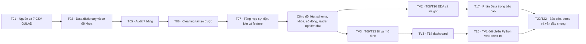

# Kế hoạch công việc TV1 — Data

**Task khởi tạo tài liệu:** T01. **Trạng thái kế hoạch:** đang áp dụng. Đây là kế hoạch thực hiện, không phải bằng chứng các bước dữ liệu đã hoàn thành. Nguồn yêu cầu là [DOCX gốc](../docs/source/TTDLTQ_script.docx); tiêu chí nghiệm thu và phụ thuộc nằm trong [backlog](../docs/06-tasks-and-dependencies.md), [rubric](../docs/02-rubric-traceability.md) và [hợp đồng dữ liệu](../docs/03-data-plan.md).

T01/#1 và T02/#2 đã nghiệm thu. **Issue hiện tại của TV1:** [#5 — T05–T07 data pipeline](https://github.com/vhoanglong54/TTDLTQ_FINAL/issues/5), [#9 — T15 QA dashboard](https://github.com/vhoanglong54/TTDLTQ_FINAL/issues/9), [#10 — T17/T20/T22 report, demo](https://github.com/vhoanglong54/TTDLTQ_FINAL/issues/10). **Owner:** TV1 (Khang); leader kiểm tra và nghiệm thu. PR là nơi ghi thay đổi và bằng chứng chính; bảng dưới đây là hướng dẫn thực hiện.

## Mục tiêu và quy tắc xuyên suốt

TV1 chịu trách nhiệm nguồn OULAD, data dictionary, audit, cleaning, join, feature engineering, đối chiếu số liệu Power BI và phần Data của báo cáo. TV1 hỗ trợ EDA, feature cho mô hình và demo; TV2 sở hữu insight/EDA, TV3 sở hữu Logistic Regression/Power BI. Mỗi task có Issue, nhánh chứa task ID, PR và bằng chứng kiểm tra; leader nghiệm thu và đóng Issue. Không gắn reviewer hoặc mention để nhắc duyệt. Ghi diễn biến thật vào [báo cáo TV1](report.md); chỉ đánh dấu rubric đạt khi có đường dẫn hiện vật, bằng chứng và leader xác nhận.

- Dữ liệu gốc gồm **7 CSV OULAD**. Hạt bảng phân tích chính là **một lượt học** theo `(code_module, code_presentation, id_student)`; không đồng nhất lượt học với số sinh viên duy nhất.
- `At_Risk = 1` cho `Fail/Withdrawn`, `0` cho `Pass/Distinction`. `final_result` và `At_Risk` chỉ là nhãn/kết quả; không đưa dữ liệu sau mốc dự báo vào feature.
- Không tạo cột sleep, stress, attendance, study hours hay previous grade khi OULAD không có. VLE clicks chỉ là proxy tương tác; `imd_band` mô tả khu vực, không phải thu nhập cá nhân. Ghi chênh lệch và quyết định tại [decision log](../docs/08-decisions-and-open-questions.md).
- CSV raw/interim/processed ở máy cục bộ và đã bị `.gitignore`; không commit dữ liệu lớn hoặc notebook có output nặng. Script trong `src/` là nguồn tái tạo; notebook dùng giải thích và kiểm tra.

## Workflow tổng quát



Phụ thuộc trong sơ đồ là điều kiện **nghiệm thu**; việc chuẩn bị có thể làm song song theo backlog. Sau mỗi mốc, lưu lệnh chạy, số liệu kiểm tra, hiện vật, PR và xác nhận của leader trong [report.md](report.md).

Riêng T02, có thể chuẩn bị khung `docs/09-data-dictionary.md` khi T01 còn mở; số dòng, kiểu thực, missing và kết luận khóa phải đợi 7 CSV được T01 xác nhận. Đây là quan hệ làm song song được mô tả trong [Issue #2](https://github.com/vhoanglong54/TTDLTQ_FINAL/issues/2).

## Issue TV1 hiện tại và cổng bắt đầu

| Issue / phần TV1 | Branch và thời điểm được phép làm | Hiện vật/bàn giao bắt buộc | Trạng thái thực tế |
|---|---|---|---|
| [#5 — T05 Audit](https://github.com/vhoanglong54/TTDLTQ_FINAL/issues/5) | `data/T05-T07-data-pipeline`; được bắt đầu vì #1/#2 đã nghiệm thu | `notebooks/01_data_audit.ipynb`, Data Quality Report, script audit trong `src/`, số liệu 7 bảng và quyết định còn mở | **Sẵn sàng bắt đầu** |
| [#5 — T06 Cleaning](https://github.com/vhoanglong54/TTDLTQ_FINAL/issues/5) | Cùng branch; chỉ sau bằng chứng audit T05 | Script cleaning, `notebooks/02_cleaning.ipynb`, quy tắc missing/duplicate/outlier/dtype và test raw bất biến | Chờ T05 |
| [#5 — T07 Join/feature](https://github.com/vhoanglong54/TTDLTQ_FINAL/issues/5) | Cùng branch; chỉ sau T06 | Aggregate hai event trước join, bảng processed cục bộ, schema/feature contract, test cardinality/unmatched/At_Risk | Chờ T06 và quyết định mốc feature |
| [#9 — T15 QA Python/Power BI](https://github.com/vhoanglong54/TTDLTQ_FINAL/issues/9) | Branch sẽ là `bi-model/T14-T16-T21-dashboard-qa`, chỉ tạo sau #7/#8; dùng output đã chốt của #5/#6 | Bảng QA tại `dashboard/`: filter, KPI/count/ratio, join, region, model output, chênh lệch và ảnh bằng chứng | Bị phụ thuộc #5/#6/#7/#8 |
| [#10 — T17 phần Data báo cáo](https://github.com/vhoanglong54/TTDLTQ_FINAL/issues/10) | Branch sẽ là `docs/T17-T22-report-demo` khi #5/#6/#8/#9 ổn định; chỉ có thể chuẩn bị outline sớm | Dataset, dictionary, preprocessing, pipeline, Data Quality Report, sơ đồ và trích dẫn IEEE | Chờ output T07; chưa viết kết quả chưa chạy |
| [#10 — T20/T22 phần chung](https://github.com/vhoanglong54/TTDLTQ_FINAL/issues/10) | Cùng branch báo cáo; sau các hiện vật data/EDA/model/dashboard | Bằng chứng rubric, phần TV1 giải thích được, slide/demo/video/vấn đáp cùng nhóm | Chờ các task đầu vào |

**Phối hợp ngoài Issue được giao trực tiếp:** #7/T09 cần TV1 bàn giao schema processed, định nghĩa KPI/mẫu số và dữ liệu map; #8/T13 cần TV1 kiểm tra hạt, feature availability, split và leakage. Đây là hỗ trợ kỹ thuật theo Issue #7/#8, không tự nhận thay owner TV3.

## Bảng giai đoạn và bàn giao

Trạng thái dùng thống nhất: `Chưa bắt đầu` → `Đang làm` → `Chờ leader nghiệm thu` → `Đã nghiệm thu`; `Bị chặn` chỉ khi có nguyên nhân cụ thể. Bảng phản ánh thời điểm lập kế hoạch. Các giai đoạn hỗ trợ chỉ được ghi hoàn tất khi owner của task xác nhận.

| Giai đoạn / task | Nội dung và hướng dẫn thực hiện | Việc thủ công cần ghi rõ | Input | Output và điều kiện kiểm tra | Phụ thuộc; bàn giao cho | Trạng thái | Ghi chú |
|---|---|---|---|---|---|---|---|
| 1. Xác minh nguồn — **T01 / [#1](https://github.com/vhoanglong54/TTDLTQ_FINAL/issues/1)** | Đã kiểm kê 7 CSV tại `data/raw/` bằng `src/verify_oulad_source.py`: tên, số dòng, số cột, SHA-256, header khóa, `final_result` và `region` nằm trong [data/README.md](../data/README.md). Đối chiếu nguồn [UCI](https://archive.ics.uci.edu/dataset/349/open+university+learning+analytics+dataset)/Open University; cập nhật giới hạn nguồn tại decision log. | Đã extract/kiểm kê; không commit CSV gốc. Ngày tải archive chính xác chưa có bằng chứng cục bộ. | 7 CSV cục bộ, `OULAD.names`, trang UCI. | `data/README.md` có bảng kiểm kê và lệnh tái tạo; test 7/7 header đạt, 10.900.970 dòng tổng, ≥5.000 dòng, ≥3 bảng nối được, có `final_result` và `region`. | T01 đã đóng; bàn giao T02, T03, T04. | Đã nghiệm thu theo Issue #1 | `OULAD.names` và CSV có chênh lệch 32.953/32.593, theo dõi D11. |
| 2. Hợp đồng dữ liệu — **T02 / [#2](https://github.com/vhoanglong54/TTDLTQ_FINAL/issues/2)** | Lập từ điển từ 7 CSV thực: đủ 43 cột, dtype, nghĩa, giá trị/missing, vai trò, hạt/khóa, sơ đồ và biến bàn giao; tổng hợp hai bảng event trước join. | **Không còn thao tác thủ công**; không commit raw. | T01 đã closed; 7 CSV `data/raw/`, [data plan](../docs/03-data-plan.md). | [docs/09-data-dictionary.md](../docs/09-data-dictionary.md), link từ `data/README.md`, script `src/profile_oulad_contract.py`; test schema/key/join. | Bàn giao TV2 dùng cho phân tích, TV3 dùng cho BI/model; đầu ra T05/T07. | Đã nghiệm thu | PR #13 đã merge; 7 bảng/43 cột, candidate keys PASS và 9 kiểm tra quan hệ/khóa đều 0 lỗi. |
| 3. Audit — **T05** | Tạo `notebooks/01_data_audit.ipynb` và báo cáo chất lượng. Cho từng bảng: shape, type, missing, duplicates, unique keys, outliers, invalid/categories; phân biệt missing có cấu trúc với lỗi. | **Có:** xem các trường hợp bất thường và ghi quyết định giữ/sửa/loại với lý do. | T01–T02, 7 CSV nguyên trạng. | Notebook chạy lại được + Data Quality Report có số liệu trước xử lý, mẫu các lỗi và lệnh/tệp bằng chứng. Kiểm kê đủ 7 bảng. | Bàn giao quy tắc cho T06 và bối cảnh cho TV2/TV3. | Chờ leader nghiệm thu | Đã chạy 04/10; `imd_band` có 1.111 `?`, `studentVle` event key lặp. Xem Data Quality Report/D13–D14. |
| 4. Cleaning — **T06** | Viết script trong `src/` xử lý missing, duplicate, category, kiểu chuỗi/ngày tương đối và outlier theo quy tắc đã duyệt; `02_cleaning.ipynb` giải thích. Giữ raw bất biến; xuất bảng trung gian trong `data/interim/`. | **Có:** duyệt từng quy tắc nghiệp vụ, nhất là `date_unregistration` trống và dòng bài không nộp; không xóa outlier máy móc. | T05, CSV raw, quy tắc data dictionary. | Script tái tạo được; số dòng/khóa trước–sau, loại trừ và missing còn lại có giải thích; notebook không có output nặng. | Bàn giao bảng sạch cho T07, TV2/TV3. | Chờ leader nghiệm thu | `?` → nullable missing, không impute; loại 787.170 duplicate toàn dòng `studentVle`; outlier giữ nguyên. |
| 5. Join, feature, cổng dữ liệu — **T07 / [#5](https://github.com/vhoanglong54/TTDLTQ_FINAL/issues/5)** | Kiểm tra cardinality và unmatched trước join; nối `studentAssessment` với `assessments`, `studentVle` với `vle` theo khóa phù hợp; tổng hợp hai bảng sự kiện về hạt lượt học rồi nối `studentInfo`, `studentRegistration`, `courses`. Định nghĩa calculated fields, mẫu số KPI và cửa sổ thời gian. | **Có:** ghi rõ quyết định ngưỡng/cửa sổ cần leader chốt; không tự chốt mốc dự báo. | T06, 7 bảng sạch, data dictionary. | `data/processed/clean_dataset.csv` cục bộ + script tạo lại + dictionary cập nhật. Test uniqueness của khóa lượt học; số dòng trước/sau, unmatched, phân bố `final_result` và tổng click/assessment không bị nhân; `At_Risk` mapping đúng. | Bàn giao TV2 cho T08/T10 và TV3 cho T09/T13. | Chờ leader chốt D05 và nghiệm thu | 32.593 output, 0 duplicate attempt key/unmatched; only `*_all_time` descriptive fields until D04/D05. |
| 6. Hỗ trợ phân tích/model — **#7/T09, #8/T13, T08/T10/T18** | Bàn giao schema processed, hạt, mẫu số KPI, `region`/map fields cho T09; kiểm tra feature availability, split và leakage cho T13; đối chiếu số liệu EDA khi TV2 yêu cầu. | **Có:** làm rõ quyết định với TV2/TV3 khi có thay đổi schema/mốc/ngưỡng. | Output T07 và yêu cầu owner từng Issue. | Hợp đồng bàn giao/version, bảng đối chiếu hoặc decision log khi định nghĩa thay đổi. | Không thay owner TV2/TV3; T09/T13 nhận đầu vào đúng hạt. | Chưa bắt đầu | T03 đã merge nhưng Issue #3 còn mở; EDA/model chưa được bắt đầu. |
| 7. QA dashboard — **T15 / [#9](https://github.com/vhoanglong54/TTDLTQ_FINAL/issues/9)** | Trên cùng filter module/presentation/region, so Python với Power BI: số lượt học, distinct students (nếu có), 4 lớp kết quả, pass/at-risk rate, region và đầu ra model. Điều tra lệch do join, mẫu số hoặc filter. | **Có:** mở Power BI, thử filter/tooltip/map và lưu ảnh hoặc bảng bằng chứng. | Dashboard T14, output T07/T13; #5/#6/#7/#8 đã nghiệm thu. | Bảng QA tại `dashboard/` có giá trị hai bên, chênh lệch, kết luận và đường dẫn ảnh; không chấp nhận lệch chưa giải thích. | T21/leader sửa dashboard; cả nhóm dùng cho demo. | Chưa bắt đầu | Chỉ tạo branch `bi-model/T14-T16-T21-dashboard-qa` khi phụ thuộc đạt; output model theo khóa lượt học. |
| 8. Viết phần Data — **T17 / [#10](https://github.com/vhoanglong54/TTDLTQ_FINAL/issues/10)** | Viết Dataset, nguồn/license, 7 bảng, hạt/khóa, dictionary, audit, cleaning, join, feature, QA và sơ đồ pipeline; trích dẫn IEEE và nêu giới hạn. | **Có:** chọn bảng/hình minh họa, kiểm tra câu chữ, số liệu và trích dẫn. | T07 cùng Data Quality Report, dictionary và mã; bản ổn định của #5/#6/#8/#9. | Phần Data có đường dẫn trong `reports/`, số liệu khớp hiện vật, đủ để ghép báo cáo ≥40 trang. | Bàn giao cả nhóm cho T20. | Chưa bắt đầu | Có thể chuẩn bị outline, không viết số liệu/kết quả chưa chạy; branch báo cáo tạo sau các phụ thuộc. |
| 9. Tích hợp và bảo vệ — **T20, T22 / [#10](https://github.com/vhoanglong54/TTDLTQ_FINAL/issues/10)** | Đối chiếu báo cáo, link video và bằng chứng rubric; tập giải thích nguồn, khóa, cleaning, KPI, proxy, leakage và luồng dashboard. | **Có:** diễn tập vấn đáp và xác nhận phần trình bày cuối với cả nhóm. | T17–T21 và bản báo cáo/demo. | Phần Data chính xác, bằng chứng rubric đủ và sẵn sàng giải thích khi vấn đáp. | Theo phụ thuộc T20/T22; bàn giao cả nhóm. | Chưa bắt đầu | T20/T22 là trách nhiệm chung; TV1 thực hiện T17 và T15 trước khi tích hợp. |

### Nền tảng đã nghiệm thu

| Issue | Bằng chứng giữ lại để dùng cho các Issue hiện tại |
|---|---|
| [#1 — T01](https://github.com/vhoanglong54/TTDLTQ_FINAL/issues/1) | PR #12 merge; 7 CSV, nguồn/license/checksum, hạt, `final_result`, `region`; leader đã đóng Issue. |
| [#2 — T02](https://github.com/vhoanglong54/TTDLTQ_FINAL/issues/2) | PR #13 merge và PR #14 nghiệm thu; dictionary 7 bảng/43 cột, sơ đồ, test khóa/join, D13 missing `?`; leader đã đóng Issue. |

Không lặp lại checklist lịch sử của #1/#2 như task còn mở. Mọi kết quả T05–T07 phải dùng hai hiện vật này làm input và ghi sai khác mới vào decision log.

## Cổng kiểm tra trước khi bàn giao dữ liệu

1. **Nguồn:** đủ 7 file có checksum, header, số dòng, license và ngày tải; ≥5.000 dòng và ≥3 bảng liên kết được chứng minh trên file thực.
2. **Từ điển và khóa:** `docs/09-data-dictionary.md` bao phủ đủ 7 bảng và tất cả cột gốc; có dtype thực, ý nghĩa, đơn vị/giá trị, missing, vai trò, sơ đồ một–nhiều và mục cần T05 xác minh. Mọi bảng có hạt/khóa được mô tả; uniqueness và unmatched được đo. Bảng phân tích chính unique theo `(code_module, code_presentation, id_student)`.
3. **Chất lượng:** missing/outlier/duplicate/invalid có thống kê trước–sau và quyết định nghiệp vụ; script chạy lại từ raw bất biến.
4. **Join:** sự kiện nhiều dòng được tổng hợp trước khi ghép; số dòng và tổng số liệu không phình bất thường; các trường hợp unmatched được giải thích.
5. **Thời gian và target:** nhãn `At_Risk` đúng mapping; feature mô hình có mốc/cửa sổ đã chốt, không chứa nhãn hay dữ liệu tương lai.
6. **Nghiệm thu:** đường dẫn hiện vật, lệnh/test, Issue/PR, xác nhận leader và tác động tới TV2/TV3 có trong [report.md](report.md). Cập nhật rubric chỉ sau khi leader xác nhận.

## Prompt hiện hành — Issue #5: T05–T07 data pipeline

Issue #5 gộp ba giai đoạn theo thứ tự bắt buộc **T05 → T06 → T07**. Sao chép prompt dưới đây, điền **một** task hiện hành vào `[T05 | T06 | T07]`; không làm trước giai đoạn phụ thuộc và không đề xuất đóng Issue #5 khi chưa có đủ ba đầu ra.

```text
Tôi là TV1 (Data/Khang) của repo TTDLTQ_FINAL. Hãy thực hiện [task ID: T05 | T06 | T07] — [Audit | Cleaning | Join và feature] trên branch `data/T05-T07-data-pipeline`, trong phạm vi Issue #5: https://github.com/vhoanglong54/TTDLTQ_FINAL/issues/5.

Trước khi sửa, đọc README.md, AGENTS.md, CONTRIBUTING.md, docs/source/TTDLTQ_script.docx (phần pipeline liên quan), docs/02-rubric-traceability.md, docs/03-data-plan.md, docs/04-analysis-model-plan.md, docs/06-tasks-and-dependencies.md, docs/08-decisions-and-open-questions.md, docs/09-data-dictionary.md, TV1/plan.md, TV1/report.md và Issue #5 hiện tại. Kiểm tra `git status`, branch, 7 CSV tại `data/raw/` và các hiện vật T01/T02. Giữ trạng thái khởi tạo cho nội dung chưa có bằng chứng.

Input đã đạt: T01/#1 và T02/#2 đã được leader nghiệm thu; 7 CSV raw bất biến tại `data/raw/`; hợp đồng 7 bảng/43 cột tại `docs/09-data-dictionary.md`; D13 ghi nhận missing mã hóa `?`. Không coi số liệu từ website là số liệu kiểm kê file cục bộ.

Mục tiêu: [trích đúng yêu cầu của T05, T06 hoặc T07 trong Issue #5 và rubric].
Việc thủ công: [ghi "không có" nếu chỉ chạy Python; nếu phải quyết định quy tắc nghiệp vụ, ghi rõ quyết định cần leader xác nhận, đường dẫn bằng chứng và tiếp tục phần độc lập]. Không mở Power BI ở T05–T07.

Hãy:
1. Chỉ thực hiện đúng stage được chọn.
   - T05: audit 7 bảng — shape, dtype, blank/`?`, duplicate, candidate key, cardinality, invalid/category, range/outlier; tạo `notebooks/01_data_audit.ipynb` và Data Quality Report.
   - T06: sau T05, viết script cleaning tái tạo được và `notebooks/02_cleaning.ipynb`; ghi quyết định giữ/drop/impute/normalize/dtype. Raw không được sửa.
   - T07: sau T06, nối dimension đúng khóa; tổng hợp `studentAssessment` và `studentVle` về `(code_module, code_presentation, id_student)` trước join; tạo calculated fields và `clean_dataset.csv` cục bộ, tái tạo được nhưng không commit CSV lớn.
2. Tạo/điều chỉnh mã trong `src/` để tái tạo được. Notebook chỉ giải thích và không commit output nặng. Không commit CSV raw, interim hay processed; không thêm định danh ngoài OULAD.
3. Ghi rõ hạt dữ liệu, schema, mẫu số, missing/outlier, proxy và mọi quyết định thay đổi. `At_Risk = 1` cho Fail/Withdrawn, `0` cho Pass/Distinction. Không dùng `final_result`, `At_Risk`, `date_unregistration`, hay assessment/VLE sau mốc dự báo làm feature.
4. Chạy và ghi kết quả thực theo stage:
   - T05: file/schema/row count, missing, duplicate, null/unique key, category/range/outlier; xác nhận `?` ở D13.
   - T06: số dòng/khóa/missing/category trước–sau, rule áp dụng và test raw bất biến.
   - T07: cardinality/unmatched, số dòng trước–sau aggregate/join, không nhân dòng, phân bố `final_result`, mapping At_Risk và leakage theo mốc.
   Với test chưa thể chạy, ghi "chưa chạy" và lý do; không suy diễn kết quả.
5. Cập nhật `docs/03-data-plan.md`, `docs/09-data-dictionary.md` và/hoặc `docs/08-decisions-and-open-questions.md` nếu định nghĩa, missing, khóa, proxy hay quyết định thay đổi. Chỉ tick rubric khi có hiện vật, test và leader xác nhận.
6. Cập nhật `TV1/report.md`: ngày, stage, công nghệ/phiên bản, input, output, lệnh và actual pass/fail, đánh giá, việc thủ công, rủi ro, bàn giao cho TV2/TV3, Issue #5/branch/PR. Cập nhật đúng một dòng Progress Log tương ứng; không ghi T05–T07 đã hoàn thành khi chỉ mới xong một stage.
7. Cuối phiên tóm tắt thay đổi, lệnh tái tạo, test, giới hạn và bước tiếp. Khi đủ T05–T07, mở một PR từ branch hiện tại với `Refs #5`, nêu lệnh chạy/số dòng/kiểm tra khóa/output. Leader kiểm tra, nghiệm thu, merge và đóng Issue; không tự ghi đã merge/đóng khi chưa có bằng chứng.

Ràng buộc diễn giải: insight chỉ là liên hệ quan sát; VLE click là proxy tương tác, không phải attendance hay study hours; không tạo cột sleep, lifestyle hoặc previous grade giả.
```
