# Kế hoạch công việc TV2 — Analysis

**Task khởi tạo tài liệu:** T03. **Trạng thái kế hoạch:** đang áp dụng. Đây là kế hoạch thực hiện chi tiết, dùng để checklist và theo dõi tiến độ của TV2 (Nadi). Nguồn yêu cầu là [DOCX gốc](../docs/source/TTDLTQ_script.docx); tiêu chí nghiệm thu và phụ thuộc nằm trong [backlog](../docs/06-tasks-and-dependencies.md) và [rubric](../docs/02-rubric-traceability.md).

**Owner:** TV2 (Nadi); leader kiểm tra và nghiệm thu. PR là nơi ghi thay đổi và bằng chứng chính; bảng dưới đây là hướng dẫn thực hiện.

## Mục tiêu và quy tắc xuyên suốt

- TV2 chịu trách nhiệm: Câu hỏi nghiên cứu (RQ), Giả thuyết, Khám phá dữ liệu (EDA), rút trích Insight, QA nội dung trên Dashboard và viết phần Analysis trong báo cáo khoa học.
- Hạt dữ liệu luôn bám sát: một lượt học `(code_module, code_presentation, id_student)`.
- **Nguyên tắc phân tích cốt lõi:** Không đưa ra kết luận nhân quả, mọi phát hiện là "sự liên hệ/khác biệt". Click VLE chỉ là proxy (đại diện tương tác), không là giờ học/điểm danh thực tế.
- Mỗi Issue dùng một nhánh và một PR `Closes #issue` có bằng chứng; leader merge là nghiệm thu và Issue đóng ngay.

## Workflow tổng quát

```mermaid
flowchart LR
    A["T01/T02/T07 · Data từ TV1"] --> B["T08 · EDA cơ bản (3-5 biểu đồ)"]
    B --> C["T10 · Phân tích sâu (Tương tác/Temporal)"]
    C --> D["T11 · Insight Log (5-7 insight chính)"]
    D --> E["Cổng Insight: Leader nghiệm thu"]
    E --> F["TV3 · T12/T14 Dashboard & Model"]
    F --> G["T16 · QA Insight trên Dashboard"]
    G --> H["T18 · Viết phần Analysis của Báo cáo"]
    H --> I["T20/T22 · Demo, vấn đáp"]
```



## Bảng giai đoạn và bàn giao (Checklist)

Trạng thái dùng thống nhất: `Chưa bắt đầu` → `Đang làm` → `Chờ leader nghiệm thu` → `Đã nghiệm thu`; `Bị chặn` (nêu rõ lý do). Khi hoàn thành, thay đổi cờ trạng thái tại đây.

| Giai đoạn / task | Nội dung và hướng dẫn thực hiện | Việc thủ công cần làm | Input | Output và điều kiện kiểm tra | Phụ thuộc; bàn giao cho | Trạng thái |
|---|---|---|---|---|---|---|
| 1. Giả thuyết — **T03** | Rà soát 6 RQ và chốt 9 giả thuyết kiểm tra được; ghi đơn vị phân tích, mẫu số, biến đo lường và tạo mẫu `insight-log.md`. | **Có:** Đọc DOCX gốc, loại bỏ biến ảo như sleep/study hours và phối hợp TV1 kiểm tra dữ liệu. | `04-analysis-model-plan.md`, DOCX gốc | PR #15; 6 RQ, 9 giả thuyết chi tiết và `insight-log.md` sẵn sàng. | T01; bàn giao TV1/TV3. | Đã nghiệm thu |
| 2. EDA Cơ bản — **T08** | Viết code Python (Matplotlib/Seaborn) vẽ 3-5 biểu đồ tĩnh. Phân phối `final_result`, nhân khẩu học, điểm số, VLE click. Điều chỉnh nhóm phân tích dựa trên thực tế phân phối. | **Không:** Code 100% bằng Python trên Notebook. | `data/processed/clean_dataset.csv` (Từ T07) | `notebooks/03_eda.ipynb` (Phần 1); Biểu đồ có caption, trục rõ ràng; Diễn giải ngắn gọn. | Sau T06, T07; Bàn giao TV3 (biết nhóm). | Chưa bắt đầu |
| 3. Phân tích Sâu — **T10** | Khám phá xu hướng tuần (temporal) của VLE, tương tác chéo (VD: IMD thấp + click ít), điểm đánh giá sớm so với kết quả cuối. Xem xét tương quan heatmap. | **Không:** Code 100% bằng Python trên Notebook. | Output T08, `clean_dataset.csv` | `notebooks/03_eda.ipynb` (Phần 2); Heatmap, Line chart, Pivot table tương tác. | Sau T08; Bàn giao T11. | Chưa bắt đầu |
| 4. Insight Log — **T11** | Chốt 5-7 Insight cốt lõi từ T10. Điền biểu mẫu `insight-log.md`: Câu hỏi, Bằng chứng, Số liệu, Cỡ mẫu, Diễn giải, Giới hạn. Xây dựng cốt truyện (storyline) về Risk Profile. | **Có:** Viết văn bản diễn giải trực tiếp, đảm bảo từ ngữ khách quan, không dùng từ "tác động/nhân quả". | Output T10 (Hình ảnh EDA) | `docs/insight-log.md` hoàn thiện với nội dung thật. | Sau T10; Bàn giao TV3 làm Dashboard/Model. | Chưa bắt đầu |
| 5. QA Dashboard — **T16** | Đóng vai user soi Dashboard (TV3 làm): Insight text có sai lệch không? Tooltip đúng số liệu mẫu không? Chart name có gây ngộ nhận nhân quả? Nhóm rủi ro có khớp định nghĩa? | **Có:** Mở workbook Tableau, click filter/selection, đọc tooltip và chụp ảnh lỗi. | T14 (Dashboard V1 từ TV3) | Bảng báo cáo QA tại thư mục `dashboard/` (danh sách lỗi UI/UX, logic Insight). | Sau T14; Bàn giao TV3 sửa lỗi. | Chưa bắt đầu |
| 6. Viết Báo Cáo — **T18** | Soạn thảo các phần: Introduction, Related Work (trích dẫn IEEE), EDA, Insight & Storytelling theo form báo cáo cuối kỳ. | **Có:** Viết văn bản, chèn hình từ T08/T10, chuẩn hóa References. | T11 (Insight Log) | Các chương tài liệu báo cáo (Word/Markdown). | Sau T11; Bàn giao cả nhóm ghép (T20). | Chưa bắt đầu |

## Prompt mẫu dùng lại cho từng giai đoạn (Dành riêng cho TV2)

Sao chép prompt sau, điền các chỗ trong `[...]` và dùng **một task ID cụ thể** mỗi lần nhờ AI hỗ trợ.

```text
Tôi là TV2 (Analysis) của repo TTDLTQ_FINAL. Hãy thực hiện [task ID: Txx] — [tên giai đoạn] trên branch gắn Txx. Tham khảo TV2/plan.md.

Trước khi sửa, đọc README.md, docs/04-analysis-model-plan.md, docs/insight-log.md, docs/06-tasks-and-dependencies.md. Kiểm tra working tree và dữ liệu/hiện vật hiện có. Giữ trạng thái khởi tạo cho phần chưa có bằng chứng.

Input: [Ví dụ: file clean_dataset.csv tại data/processed/, notebook 03_eda.ipynb].
Mục tiêu/điều kiện nghiệm thu: [trích tiêu chí Txx từ backlog và rubric].
Việc tôi phải làm thủ công: [ghi rõ nếu cần đọc chart và tự rút ra insight văn bản, hay phải mở dashboard Tableau].

Hãy:
1. Kiểm tra tính sẵn sàng của dữ liệu đầu vào: đảm bảo đúng hạt dữ liệu, đủ các cột cần thiết cho giả thuyết.
2. Thực hiện đúng phạm vi Txx. Viết mã Python (Matplotlib/Seaborn) sạch sẽ, tái tạo được, có comment giải thích các trục và loại biểu đồ. Không chạy các tập lệnh quá nặng.
3. Nếu là T11, điền chính xác biểu mẫu `insight-log.md`, tuyệt đối không dùng từ ngữ khẳng định nhân quả (dùng từ: có liên hệ, có xu hướng, phân bố khác biệt). Đảm bảo nêu rõ cỡ mẫu.
4. Cập nhật `TV2/report.md` (nếu có tạo) về tiến độ thực tế, lệnh đã chạy, kết luận và link PR.
5. Tóm tắt thay đổi và bàn giao chính xác phần output cho TV3 (Model & Dashboard).
```
